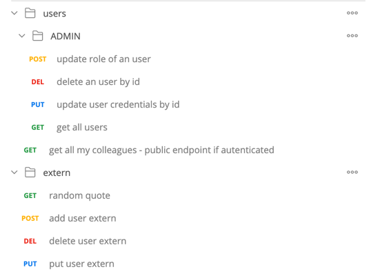
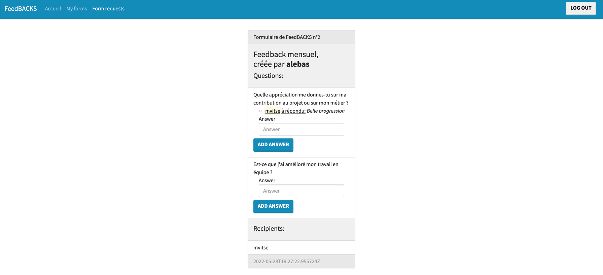

# FeedBACKs

## Projet

### Description du projet:

Application web sécurisé de demande de feedbacks aux collègues.

- Création d'un formulaire avec ajouts de questions
- Partage du formulaire à un ou plusieurs collègues
- Ceux-ci peuvent y répondre.

### Équipe

- Maxime VITSE
- Axel LEBAS

### Langage / Framework utilisé

Java SpringBoot & Hibernate

Lombook (Getters/Setters auto généré avec une annotation au début des classes)

### Niveau sur le langage / framework utilisé

- Maxime VITSE:
    - J'ai testé SpringBoot en faisant une API très simple (ADD, GET ALL, GET BY ID) , il y a déjà 2 ans de ça : https://github.com/Weamix/SpringBootAPI 
    - Stack PHP/Symfony au départ mais je suis passé au Java depuis Septembre 2020
- Axel LEBAS:
    - Aucune expérience avec SpringBoot
    - Compétences limitées en Java

## Installation

### Recquis

- Docker (Java 17 & postgres inclus)
- Bash/Zsh

### Links (attention l'IP présent ici peut varier chez vous)

Swagger : [http://localhost:8080/swagger-ui/index.html][http://localhost:8080/swagger-ui/index.html]


API : [http://localhost:8080/][http://localhost:8080/]

Postman available with more functionnalities than the front, in this directory : [feedBACKs.json](./postman/feedBACKs.json)




[Github board](https://github.com/users/Weamix/projects/1/views/2
) : plus de détails en cliquant sur les cartes du board

Front repository : [https://github.com/alebas1/feedbacks-front][https://github.com/alebas1/feedbacks-front]




### Defaults accounts :
```
username / password (role) 

mvitse / maxime (admin)
alebas / lebas (admin)
cfasquel / fasquel (user)
```

### How to run? (Depuis la branche base)

Depuis le dossier racine de l'app :
```
Pour build le jar de l'app (pas besoin de le faire on l'a push dans le repo)
# commande qui fonctionne très bien dans le plugin maven helper de intellij :
mvn install -DskipTests

Puis pour lancer l'app et la bdd :
docker build -t feedbacks.jar . && docker-compose up
```

[http://localhost:8080/swagger-ui/index.html]: http://localhost:8080/swagger-ui/index.html

[http://localhost:8080/]: http://localhost:8080/

[https://github.com/alebas1/feedbacks-front]: https://github.com/alebas1/feedbacks-front